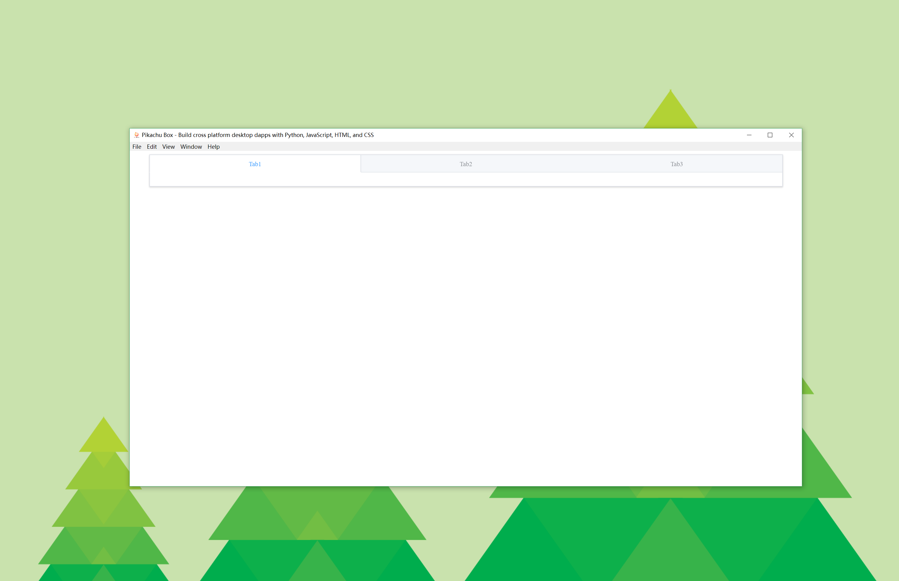

# Pikachu Box

- [1. Introduction](#1-introduction)
- [2. Getting started](#2-getting-started)

## 1. Introduction

Welcome to Pikachu Box, a cross platform desktop dapps is waiting for your. Based on Pikachu Box, you can build GUIs for your Python DApp using Electron and web technologies i.e HTML, CSS and JavaScript-this means taking advantage of the latest advancements in front-end web development to build desktop DApp but also taking advantages of Python and the powerful libraries it has to easily implement advanced requirements.

## 2. Getting started

Create virtual environments (optional).

```shell
virtualenv --no-site-packages venv
```

If you choose to create a virtual environment, you may need to activate your project's virtual environment.

```shell
.\venv\Scripts\activate
```

Install the necessary dependencies.

```shell
pip install -r requirements.txt
npm install
```

Run your DApp.

```shell
npm start
```

